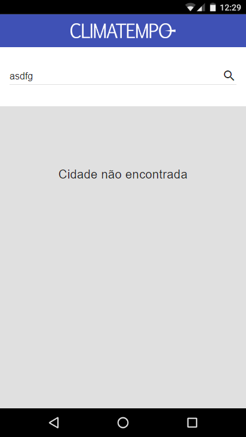
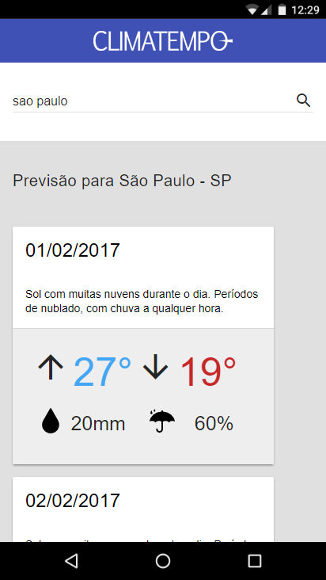

# Recursos utilizados

 - Node.js;
 - Express.js:  ```npm install express --save```;
 - Http-server: ```npm install http-server -g```;
 - JQuery:  ```npm install jquery```;
 - Material Design Lite: ```npm install material-design-lite --save```;

# Execução
  - Web-service: Selecione a pasta front-end no console ou prompt, e execute o comando node index.js, a partir daí o web-service estará rodando(a porta padrão está 9000, caso queira alterar, entre na pasta web service; abra o arquivo index.js e no final do arquivo altere a seguinte linha de código ```app.listen(9000);```, troque o 9000 pelo numero da porta desejada) e execute novamente o comando node index.js;
  
  - Front-end: Selecione a pasta front-end no console ou prompt, e execute o comando(após installar o http-server com o comando acima) http-server (a porta padrão é 8080, caso queira alterar utilize o parâmetro -p<numero_da_porta>), no arquivo index.html nas duas primeiras linhas da tag script há duas variáveis, ip e porta, altere estas informações antes de executar o comando citado acima caso seja necessário, o ip para o ip da máquina em que o web service está rodando, e a porta caso seja alterada no web-service;
___
# Preview
<p align="center">
      
</p>

<p align="center">
      
</p>
